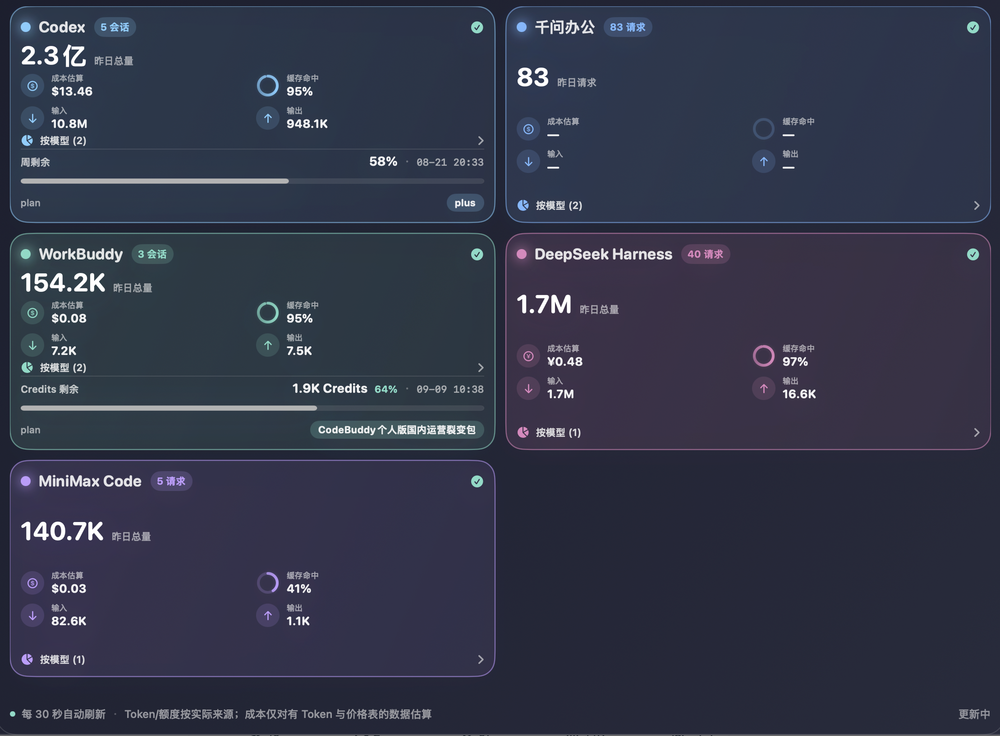
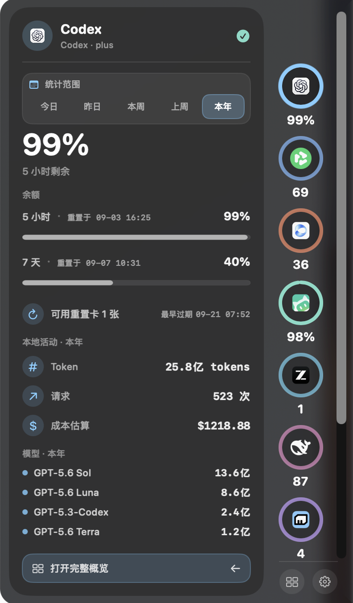

# AI Usage Bar




AI Usage Bar is a local-first macOS menu bar application for viewing usage, subscription quotas, balances, and estimated costs from multiple AI coding tools in one place.

The app does not require a separate cloud backend. It primarily reads session files, logs, and databases left by local clients. When official subscription quotas, account balances, or server-side usage windows are needed, it uses the credentials already available on the Mac to call the corresponding official APIs.

> This project is currently intended primarily for personal use on a local Mac. Local file formats and official APIs may change as the supported products evolve. Costs shown in the dashboard are estimates, while quotas and balances are labeled with their data sources.

## Download

Download the latest Apple Silicon (`arm64`) ZIP from [GitHub Releases](https://github.com/HITLiuJiahao/ai-usage-bar/releases). Unzip the download, move `AIUsageBar.app` to the Applications folder, and open it by right-clicking **Open** the first time if macOS asks for confirmation.

## Features

- Runs in the macOS menu bar. Click the icon to open the dashboard; right-click for refresh, settings, and quit actions.
- Shows a compact, on-demand usage Dock attached flush to the right edge of the screen, with a broad curved shoulder that blends into the desktop. Click the menu bar indicator or move the pointer to the rightmost edge to wake it; hover a provider to expand its details to the left, and move away to let it collapse. The original full dashboard remains available from the Dock.
- Supports seven time ranges: today, yesterday, this week, last week, this month, last month, and this year.
- Distinguishes the standalone QwenWork client from ZCode and Doubao Work local usage records, and includes KIMI Desktop (Kimi Work and Kimi Code), OpenCode, Qianwen Office Mode, and DeepSeek Harness local usage.
- Uses a two-column card layout and adjusts its height based on the number of available providers. Click **By Model** to expand model-level details.
- Displays tokens, input, output, cache reads, cache-hit rate, reasoning tokens, request counts, Credits, subscription windows, and estimated costs.
- Uses each supported tool's official brand icon in the Dock and dashboard, with a SF Symbol fallback if an icon resource is unavailable.
- Refreshes automatically when the dashboard opens, on a background timer, or manually from the refresh control at the top.
- Checks GitHub Releases automatically every six hours and shows an in-app update action when a newer version is available. Clicking it downloads the verified package, replaces the current app with rollback protection, and reopens the new version.
- Supports multiple server-side accounts, with credentials stored in the macOS Keychain.
- Supports launching automatically at login.
- Lets you edit the relative order of AI tools in the edge Dock from settings; the order is saved locally and is also used by the full dashboard.
- Supports Simplified Chinese (default), English, Japanese, and Korean; the selected interface language applies immediately and is saved locally.
- Providers without usable data do not create empty cards; they are listed in small text at the bottom instead.
- Estimates costs using model-specific input, output, and cache-token prices, including time-window pricing where applicable. CNY prices are displayed in yuan.

## Supported Tools and Data Sources

| Tool | Local data | Official/server-side data | Main metrics |
| --- | --- | --- | --- |
| Codex | `~/.codex/sessions`, `~/.codex/archived_sessions` | ChatGPT backend `wham/usage` subscription windows | Tokens, requests, models, input/output/cache usage, estimated cost, 5-hour and weekly quotas |
| KIMI Desktop | `~/Library/Application Support/kimi-desktop/daimon-share/daimon/runtime/kimi-code/home/sessions` (`wire.jsonl`) | KIMI `MembershipService` subscription and stats endpoints | Requests, sessions, models, input/output/cache tokens, estimated CNY cost, shared membership Credits balance, plan expiry, and Kimi Code 5-hour/7-day quotas with reset times |
| QwenWork | `~/.qwenworkcn/projects` and compatible JSONL log directories | QwenWork `account-context` | Requests, sessions, active time, models, subscription/add-on/shared Credits |
| ZCode | `~/.zcode/cli/db/db.sqlite` (`model_usage`) | — | Tokens, input/output/cache reads, reasoning, requests, sessions, models, and price-based cost estimates |
| Doubao Work | `Default/IndexedDB/chrome_doubaowork-chat_0.indexeddb.leveldb` (`ext_window_usage`), plus `Tea/tea.db` and `sdk_storage/log` (`net_report_dev`) | — | Per-model-call counts with date-correct local activity; token and cost fields are not exposed by the local logs |
| OpenCode | `~/.local/share/opencode/opencode.db` (`message`) | — | Tokens, input/output/cache usage, requests, sessions, models, and price-based cost estimates |
| Qianwen Office Mode | `~/Library/Application Support/Qianwen/qwen-agent` (`thread-events.jsonl`) | — | Tokens, input/output/cache usage, requests, sessions, models, and price-based cost estimates |
| WorkBuddy | JSONL files under `~/.workbuddy/projects` and `~/.workbuddy/logs` | Local account information | Tokens, input/output, cache hits, reasoning, Credits, models, requests, and estimated cost; every JSONL record containing `providerData.rawUsage`, including `function_call` records, counts as one model call |
| DeepSeek Harness | `~/.dsh/sessions` (`.zstd` or Tokei JSONL cache) | — | Tokens, input/output/cache usage, requests, models, and price-based cost estimates |
| MiniMax Code | `~/.minimax/v2/sqlite/runtime-state.sqlite` and compatible logs | MiniMax coding plan API | Tokens, input/output, cache reads/writes, reasoning, requests, models, estimated cost, and 5-hour/weekly quotas |

### Data Source Principles

Every metric carries a data source:

- **Server**: Data returned by an official quota, plan, or balance API.
- **Local logs**: Data aggregated from local client logs or session databases.
- **Local cache**: The most recent successful result retained when an official API fails, so the dashboard does not suddenly become empty.
- **Not read**: The required local file, credential, or field is unavailable or cannot be parsed reliably.

If a product only provides Credits, request counts, or a subscription percentage and does not publish a reliable token-billing formula, the app does not force-convert Credits into tokens or US-dollar costs.

## Cost Estimation

Cost estimates are intended for comparison and monitoring; they are not invoices. The app first looks for local Tokei pricing files:

```text
~/.tokei/pricing.json
~/.tokei/pricing_overrides.json
```

If the pricing files are unavailable, the app uses conservative built-in prices and model aliases. The override file takes precedence over built-in values, allowing users to update prices according to official pricing.

The basic calculation is:

```text
Estimated cost ≈ uncached input tokens × input price
                + cache-read tokens × cache-read price
                + cache-write tokens × cache-write price
                + output tokens × output price
```

Uncached input tokens are calculated by subtracting cache-read and cache-write tokens from the total input where appropriate, avoiding double counting. For models with documented long-context pricing, the adapter applies the model-specific long-context multiplier.

Special cases:

- Codex Auto Review is mapped to `GPT-5.3-Codex` pricing.
- DeepSeek Harness costs use the provider's official CNY peak/off-peak price table when the model and timestamp can be matched.
- WorkBuddy matches the actual model names in its logs to Kimi/Hy model pricing and prefers the local Tokei pricing files.
- WorkBuddy treats `prompt_tokens` as the complete prompt total. Its cache-hit rate is `prompt_cache_hit_tokens / prompt_tokens`; cache hits are not added to input or cost a second time.
- ZCode treats `input_tokens` as the complete prompt total and uses `computed_total_tokens` as the authoritative total. Cache reads are retained as a separate breakdown for hit-rate and cost estimation.
- OpenCode costs prefer a stored message cost and otherwise use the local model price table.
- MiniMax Code estimates cost from local model usage and MiniMax's official token prices. Actual Token Plan deductions are determined by MiniMax's server-side quota.
- QwenWork Credits/plan quotas retain their original units. Subscription Credits are not presented as API costs.
- KIMI Desktop cost estimates use Kimi's public K3/K2.6 token prices in CNY. The shared membership Credits balance and Kimi Code rate limits remain separate server-side metrics and are not converted into token costs.
- Qianwen Office Mode costs use public model token prices as estimates rather than official Credits deductions.
- Doubao Work counts the local chat ledger's `ext_window_usage` records, so multiple model calls inside one work task are counted separately. It uses the chat folder date for daily buckets, keeps history in the local cache, and falls back to the task ledger or completion events only when model-usage records are unavailable. The long-lived `/alice/office/tool_local/chunk_stream` local-tool channel is intentionally excluded because it reconnects periodically without representing a new model request. The current local event payload does not expose reliable input/output token fields, so Token and cost are left unavailable instead of estimated from byte sizes.

## Privacy and Security

- Local log parsing, deduplication, and aggregation are performed on the Mac.
- The app does not store prompts, source code, or request bodies. It only retains the statistics needed for the dashboard cache.
- Access tokens and API keys entered manually are stored in the macOS Keychain, not in the project directory.
- KIMI Desktop credentials are read transiently from its existing local sign-in state only for official membership requests; they are not copied into AI Usage Bar's cache.
- The app makes HTTPS requests to an official provider API only when it needs to read balance or quota information.
- The encrypted QwenWork `auth-v2.dat` file is not bypassed or decrypted. Credentials that are not explicitly provided are never guessed.

## Requirements

- macOS 13 or later.
- Swift 5.9 or later.
- The default build script produces an Apple Silicon (`arm64`) application.
- The project uses only system frameworks: SwiftUI, AppKit, Combine, Security, and ServiceManagement.
- Reading compressed DeepSeek Harness logs requires `zstd`. If a Tokei cache is available, the cache can be used instead.

## Build and Run

After cloning the project, run this command from the project root:

```sh
swift run AIUsageBar
```

To generate a double-clickable menu bar application bundle:

```sh
bash scripts/build-app.sh
open dist/AIUsageBar.app
```

The script first attempts a SwiftPM Release build. If the local SwiftPM toolchain and system SDK have incompatible minor versions, it falls back to compiling directly with `swiftc`, then creates and signs `dist/AIUsageBar.app`. It also creates `dist/AIUsageBar-arm64.zip` and its SHA-256 sidecar for GitHub Releases; GitHub exposes the uploaded asset digest to the in-app updater.

For a static type check only:

```sh
xcrun swiftc \
  -typecheck \
  -module-cache-path /private/tmp/AIUsageBarSwiftModuleCache \
  -target arm64-apple-macosx13.0 \
  -sdk "$(xcrun --show-sdk-path)" \
  Sources/AIUsageBar/*.swift
```

## Credential Configuration

Manual configuration is usually unnecessary: the app attempts to use the local sign-in state of installed clients. When credentials must be provided explicitly, add an account through the dashboard settings window or use one of these environment variables:

| Environment variable | Purpose |
| --- | --- |
| `QWENWORK_ACCESS_TOKEN` | QwenWork official Credits API |
| `MINIMAX_API_KEY` | MiniMax coding plan quota API |
Never commit real tokens, API keys, database keys, or local logs to GitHub.

## Settings and Accounts

Click the gear icon in the upper-right corner of the dashboard, or right-click the menu bar icon and choose **Account Settings…**:

1. Enable or disable launch at login under **App Settings**.
2. Use **Software Update** to check GitHub Releases manually or install a detected update.
3. Select a product under **Add Server Account**, then enter an account name and an access token/API key.
4. Credentials for added accounts are stored in the macOS Keychain. Account metadata is stored at:

   ```text
   ~/Library/Application Support/AIUsageBar/accounts.json
   ```

5. Removing an account only deletes the account configuration saved by AI Usage Bar. It does not delete local data belonging to the corresponding client.
6. Adjust the **Sidebar AI Tool Order** section by dragging tools or using the up/down controls. The order is retained across launches, and **Restore Default** returns to the built-in order.
7. Choose a language in the **Language** section. The default is Simplified Chinese; the selection applies immediately and is retained across launches.

## Project Structure

```text
.
├── Package.swift                     # SwiftPM package definition
├── Resources/Info.plist              # Menu bar app metadata and LSUIElement setting
├── Resources/ProviderIcons/          # Bundled official provider brand icons
├── scripts/build-app.sh              # Release build, packaging, and signing
├── Sources/AIUsageBar/
│   ├── AppModel.swift                # Refresh scheduling, concurrent reads, and snapshot state
│   ├── Models.swift                  # Providers, metrics, time windows, and card models
│   ├── Providers.swift               # Provider implementations and server-side quota reads
│   ├── CodexUsage.swift              # Codex sessions, quotas, and pricing
│   ├── KimiUsage.swift               # KIMI Desktop sessions, quotas, and CNY pricing
│   ├── QwenWorkUsage.swift           # Qwen Work JSONL aggregation
│   ├── ZCodeUsage.swift               # ZCode local SQLite model usage aggregation
│   ├── OpenCodeUsage.swift            # OpenCode SQLite usage aggregation
│   ├── DoubaoWorkUsage.swift          # Doubao Work local completion-event aggregation
│   ├── QianwenOfficeUsage.swift       # Qianwen Office Mode JSONL aggregation
│   ├── WorkBuddyUsage.swift          # WorkBuddy JSONL and Credits-ledger aggregation
│   ├── DeepSeekHarnessUsage.swift     # DeepSeek Harness compressed-log aggregation
│   ├── MiniMaxCodeUsage.swift        # MiniMax Code SQLite aggregation
│   ├── QwenWorkQuota.swift           # Qwen Work official Credits
│   ├── LocalData.swift               # Local JSON, JSONL, and compatibility parsing
│   ├── Paths.swift                   # Local paths for supported clients
│   ├── DashboardViews.swift           # Dashboard UI
│   ├── EdgeDockViews.swift             # Right-edge usage Dock and hover details
│   ├── AppUpdater.swift                # GitHub release checks, verification, and self-update
│   ├── ProviderOrder.swift             # Persisted provider ordering and snapshot sorting
│   ├── SidebarOrderEditor.swift        # Settings UI for editing the provider order
│   ├── Views.swift                    # Menu bar and settings UI
│   ├── StatusBarController.swift     # Status bar icon, panel, and context menu
│   └── SettingsWindowController.swift # Explicit settings window
└── README.md
```

Each provider should return a unified `ProviderSnapshot`, keeping data acquisition separate from presentation. Adding a provider usually requires updates to paths, scanning, the provider implementation, display colors/icons, and the order of `ProviderID.trackedCases`.

## Refresh and Failure Handling

Providers are scanned concurrently, so a slow server-side request does not block other local data sources. If the refresh control is clicked again while a refresh is already running, the request is coalesced into one follow-up refresh instead of triggering duplicate scans.

If the first full read fails, the app retries automatically. When an individual server-side request fails, the most recent successful cached result is retained. Local log scans use file size and modification-time caches to avoid reparsing the entire history every time the dashboard opens.

Codex subscription quotas are refreshed automatically every 30 seconds. A successful quota response is cached for at most 15 seconds, and a manual refresh bypasses that cache and the local HTTP response cache. The upstream service can still take some time to reflect a just-completed request.

Application updates are checked against the public GitHub Releases API every six hours (and can be checked manually in Settings). An update is considered installable only when the release contains a compatible ZIP asset with GitHub's SHA-256 digest. The package is unpacked into a private temporary directory, checked for the expected bundle identifier, executable, version, and code signature, then installed by a short-lived helper script that keeps a backup until the new app has been validated and reopened.

## Known Limitations

- A product's quota, Credits, request count, and token count are different units and cannot be compared directly.
- Client upgrades may change JSONL, SQLite, or log fields. When a field cannot be parsed reliably, the dashboard shows **Unavailable** instead of guessing.
- The QwenWork official quota API requires a valid access token. Encrypted local sign-in state is not forcibly decrypted.
- KIMI Desktop local usage is read from Agent `wire.jsonl` files. Its shared membership Credits and Kimi Code 5-hour/7-day windows are read from the official MembershipService when the desktop client's existing sign-in state is available.
- Qianwen Office Mode monitoring reads the main Qianwen desktop app's `qwen-agent` thread events and only counts provider-backed `workbench_*` turns.
- ZCode local App Usage is read from the `model_usage` table. Remote Z.ai/BigModel Coding Plan quota data is not read by this adapter.
- OpenCode monitoring reads assistant token records from its local SQLite message ledger.
- Doubao Work monitoring reads only the local completion-event ledger under `~/Library/Application Support/DoubaoWork`; it does not read prompts, request bodies, or byte sizes as token estimates.
- DeepSeek Harness monitoring reads compressed session logs or the corresponding Tokei decompression cache.
- Server-side subscription quotas may lag behind local session logs; the dashboard labels the sources separately.
- Self-updates require a published GitHub Release with an Apple Silicon ZIP asset and a SHA-256 digest. The app must be installed in a writable location such as `/Applications` or `~/Applications`; if not, Settings reports the problem without changing the current app.
- Before a public release, add formal app signing, notarization, release packages, and a license.

## Contribution Guidelines

When submitting a new adapter or a fix, please include:

- A sanitized description of the local file structure, rather than raw logs.
- The data source and deduplication rules.
- Formulas for time windows, cache-hit rates, costs, or Credits.
- Expected behavior when data is missing, fields are absent, or an API fails.
- At least one `swiftc -typecheck` run or a complete packaging validation.

Do not submit personal logs, tokens, API keys, Keychain exports, database files, or statistics caches generated from them.

## License

This repository does not currently include a formal open-source license. Before publishing publicly or accepting external contributions, add a license that reflects the maintainer's intentions.
